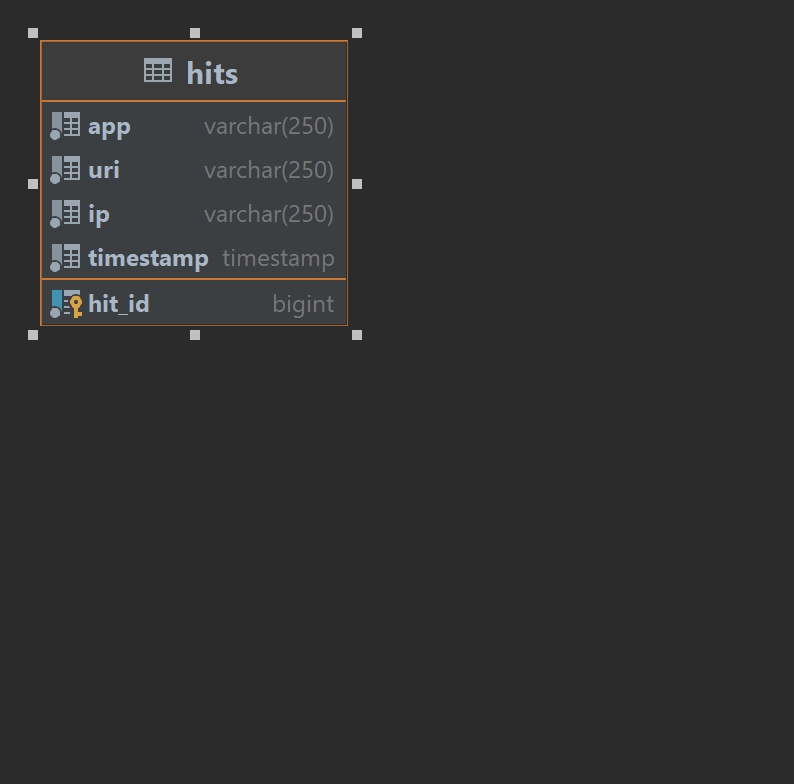
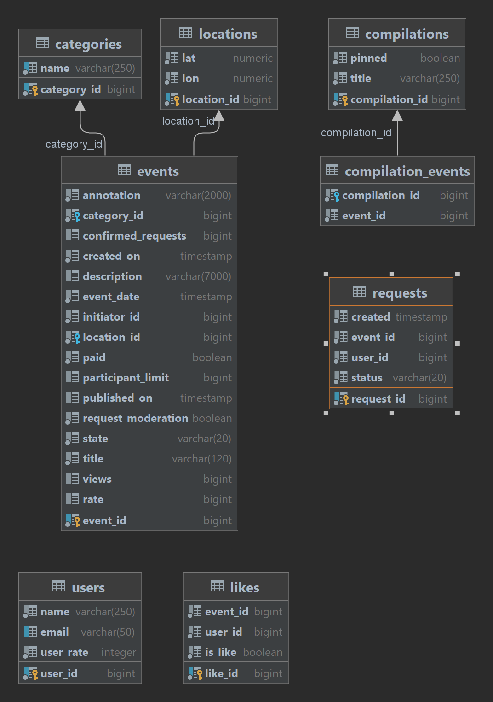

# java-explore-with-me

https://github.com/Sapsan016/java-explore-with-me/pull/10

Explore With Me Project

Дипломный проект
Приложение-афиша для добавления пользователями различных событий, с возможностью делиться информацией о событиях и находить компанию для участия в них. пользователей
Spring Boot 2.7, Maven, PostgreSQL, Lombok, Spring JPA, REST, Docker, Hibernate

Приложение состоит из двух модулей:
Service - содержит всю основную логику работы приложения и базу данных, делится на открытую часть API (Public), API для авторизованных пользователей (Users), API для администратора (Admin)
Statistic - сохраняет статистику обращений к публичным эндпойнтам основного модуля в свою базу данных, а также содерит подмодули DTO и Client.

Приложение развертывается в четырех контейнерах: stats-container, stats-db-container, ewm_main-service-container, ewm-main-db-container.

## Схема БД статистики

## Схема БД основного сервиса

